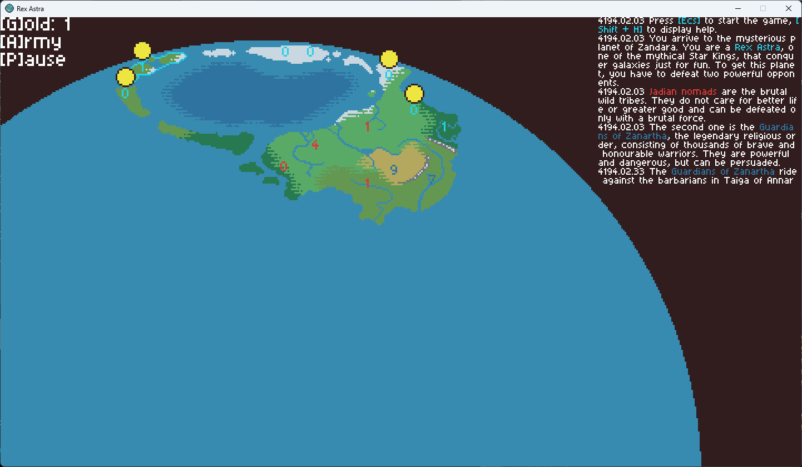

# Rex Astra



Rex Astra is a minimalistic RTS built with [LOVE](https://love2d.org/). You can download it in the [Releases](https://github.com/girvel/rex_astra/releases).

## Installation

### Windows

1. Go to [the latest release](https://github.com/girvel/rex_astra/releases/latest) and download `windows_rex_astra.zip`
2. Unzip it
3. Launch `Rex Astra.exe` inside to play the game

### Cross-platform

1. Go to [the latest release](https://github.com/girvel/rex_astra/releases/latest) and download `rex_astra.love`
2. Download and install [LOVE](https://love2d.org/)
3. Launch `rex_astra.love` with the LOVE

## Manual building

1. Install python3, python3-pip and ResourceHacker. Make sure they are in PATH.

2. Install build-requirements:
```zsh
pip install -r build-requirements.txt
```

3. Launch build script:
```zsh
./build
```

The results will appear in bin/ folder.
